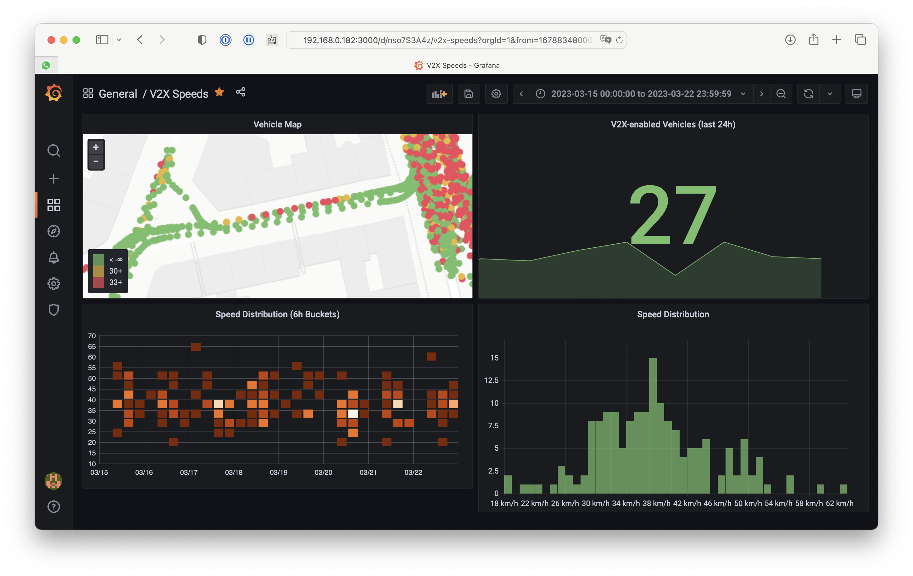
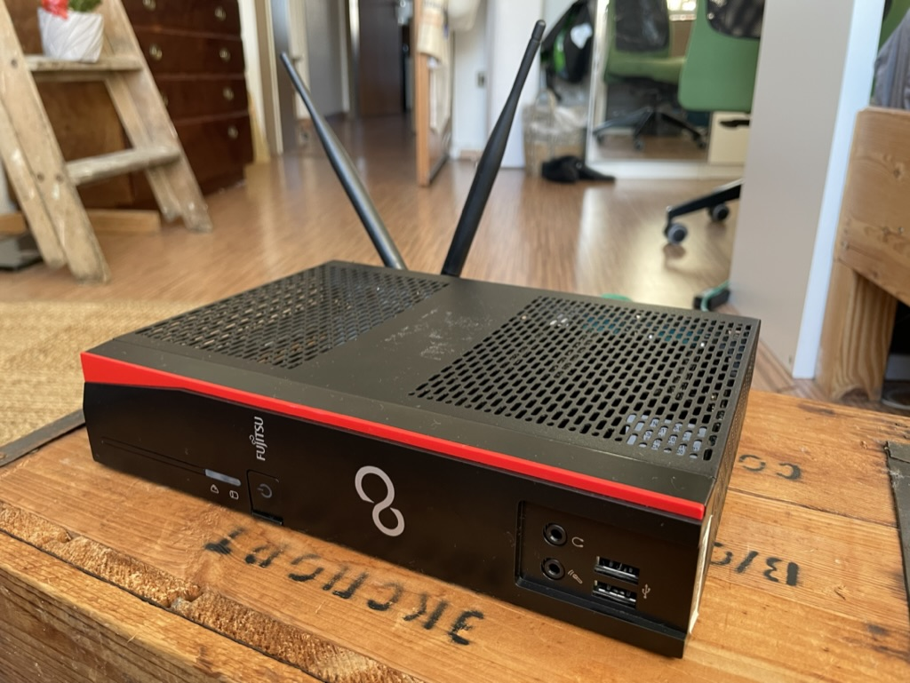
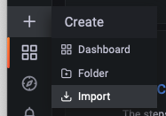

# Setting up a WiFi-based V2X Sniffer

Ever heard of V2X? The idea is that cars announce their position and speed to improve safety, using wireless broadcasts. In this article, I'll guide you through the process of setting up a low-cost, WiFi-based V2X sniffer. V2X currently has two competing standards: **Cellular-based C-V2X** and **WiFi-based ITS-G5**. Although it's unclear which standard will ultimately prevail, **ITS-G5 vehicles are already on the road in Europe**. This makes it the perfect time to build a sniffer.

While automotive-grade V2X hardware and development kits are available, they can be expensive. The idea here is to use older WiFi cards to sniff V2X bands. Fortunately, Linux WiFi driver patches for this purpose were developed a few years ago.



I highly recommend reading this excellent write-up by Harrison Sand: [802.11p V2X hunting](https://harrisonsand.com/posts/802-11p-v2x-hunting/). In 2019, Harrison faced challenges with the required patches and opted for an outdated OpenWRT installation. Thankfully, these issues have since been resolved: the [11p-on-linux](https://gitlab.com/hpi-potsdam/osm/g5-on-linux/11p-on-linux) project by Lukas Pirl & friends works great with up-to-date mainstream distros!

Now, let's move on to a streamlined guide featuring the steps that worked for me.

## Requirements

The patches best work for cards with the Atheros AR9462 chipset. That card is mini-PCIe only - USB dongles with the correct chipset apparently don't exist (I've wasted *hours* on this). As you need to patch some kernel drivers, I highly recommend using dedicated hardware for this project.

My setup:
-  Fujitsu Futro S920 thin client (with **free mini-PCIe** slot)
-  Atheros AR9462 AR5B22 WiFi-card (mini-PCIe)
	- 2x generic WiFi antenna with IPEX U.FL connector 

Both cost less than 50€ combined (refurbished) and availability seems OK in Germany.

My machine:


## 🛜 A word of caution

ITS-G5 works on frequency bands that might be restricted in your region - please check that before following any of these steps. ITS-G5 is not within the license-free WiFi bands, but slightly above. 

The `11p-for-linux` patches enable both receiving and sending on ITS-G5 bands. Special care is required to ensure you don't transmit any data. It is your obligation to ensure that - **this guide does not cover safe operations of the sniffer.**

# Preparations

1. Install the WiFi-card to the thin client
2. Install a Linux distro (the patches are tested with Debian and Ubuntu Server, so I'm going for that)
3. Enable SSH
4. enable the  `NOPASSWD` option for `sudo` for easier automatic provisioning

# Setup

### Patching WiFi Drivers

Next we'll apply the patches that enable V2X. Check out the repository for detailed instructions: [11p-on-linux](https://gitlab.com/hpi-potsdam/osm/g5-on-linux/11p-on-linux) I used the Ansible playbook to automatically provision the whole patching process. The Ansible playbook runs on your *host* computer and instruments the target via SSH.

## On the host: Ansible deployment

```
git clone https://gitlab.com/hpi-potsdam/osm/g5-on-linux/11p-on-linux.git
cd 11p-on-linux
```
Install Ansible:
```
11p-on-linux$ python3 -m venv .venv
11p-on-linux$ source .venv/bin/activate
11p-on-linux$ pip3 install ansible
```
Test SSH connection to the target -- replace `myhost` with your actual SSH host, like `merlin@192.168.0.12`:
```
11p-on-linux$ ssh -t myhost sudo python -V
```
If that works, add your SSH target to the file `ansible/inventory`:
```
echo myhost >> ansible/inventory
```

Test Ansible:
```
11p-on-linux$ (cd ansible && ansible all --become --ask-become-pass -m ping)
```
Run the playbook to apply all patches:
```
11p-on-linux$ (cd ansible && ansible-playbook --ask-become-pass example-playbook.yml)
```

Now we're already done - our WiFi card now supports 802.11p monitor mode and channel restrictions for the 5900 MHz band have been removed. Next, we can start sniffing.

# Running the Sniffer

I was looking to store the raw V2X traffic in a PCAP (using `tcpdump`), and have a live visualization. We need three components here:

- `00-docker`: starts InfluxDB and Grafana
- `01-setup-interface`: loads the patched drivers and configures the WiFi interface for V2X
	- the script also starts `tcpdump` in background for raw PCAPs
- `02-pyshark-influx-monitor`: push V2X data to InfluxDB, so that it appears on our dashboard.

The script are a starting point; you'll need to change some paths and interface names to match your system.  

# Grafana-Dashboard

Once InfluxDB, Grafana and the `monitor.py` script are running, you can browse to `http://host:3000` and configure Grafana. Add the InfluxDB as a source, and import the Dashboard YAML.



##  Configuring the WiFi Interface for V2X

First check the WiFi interface name - on my machine it is `wlp2s0`:
```
$ ip a
…
4: wlp2s0: <BROADCAST,MULTICAST,UP,LOWER_UP> mtu 1500 qdisc noqueue state UP group default qlen 1000
    link/ether d8:5d:e2:53:94:b9 brd ff:ff:ff:ff:ff:ff
    inet6 fe80::da5d:e2ff:fe53:94b9/64 scope link 
       valid_lft forever preferred_lft forever
…
```

⚠️ **IMPORTANT** ⚠️ your computer can potentially **send** packets through these interfaces -- even without any action from your side (think of IPv6 discovery stuff). As I said before, this is not a license-free band and transmitting isn't allowed.

I *think* the following `iptables` rules should do the trick, but don't take my word for it:
```
sudo sysctl -w net.ipv6.conf.wlp2s0.disable_ipv6=1
sudo iptables -I OUTPUT -o wlp2s0 -j DROP
```

For actually receiving ITS-G5 messages, set the interface to OCB mode on Channel 5900:
```
sudo ip link set wlp2s0 down
sudo iw dev wlp2s0 set type ocb
sudo ip link set wlp2s0 up
sudo iw dev wlp2s0 ocb join 5900 10MHZ
```

Now, when running `tcpdump`, you should eventually see broadcasts from cars coming in:
```
sudo tcpdump -i wlp2s0
```
## Reboot Persistence

I created a script with all steps above to enable ITS-G5 sniffing during boot, see `01-setup-interface`.

The script gets called through a `systemd` unit. Create a file `/etc/systemd/system/its-g5-sniffer.service`: 
```
[Unit]
Description=Start ITS-G5 (802.11p OCB) Sniffer
[Service]
ExecStart=/bin/bash /home/merlin/its-g5-sniffer.sh
[Install]
WantedBy=multi-user.target
```

Enable & start the unit:
```
sudo systemctl daemon-reload
sudo systemctl enable its-g5-sniffer
sudo systemctl start its-g5-sniffer
```

You can check if everything went well with `journalctl`.
